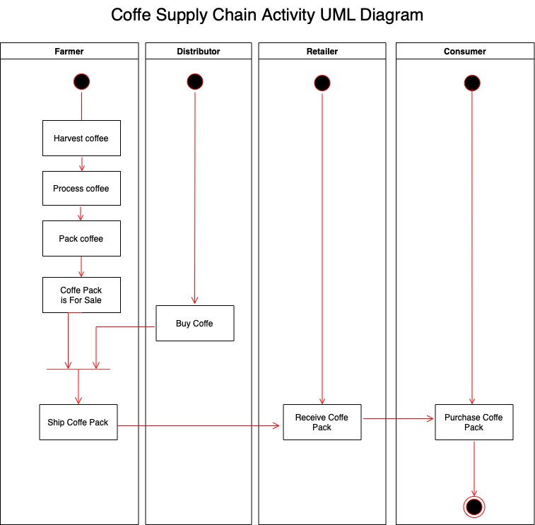
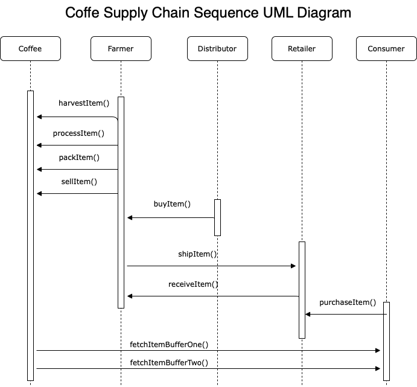
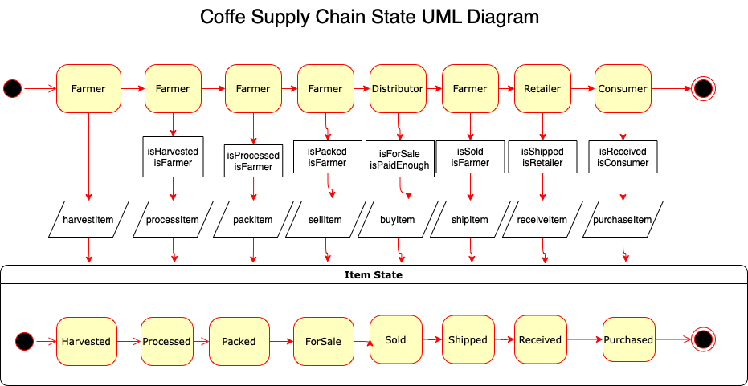
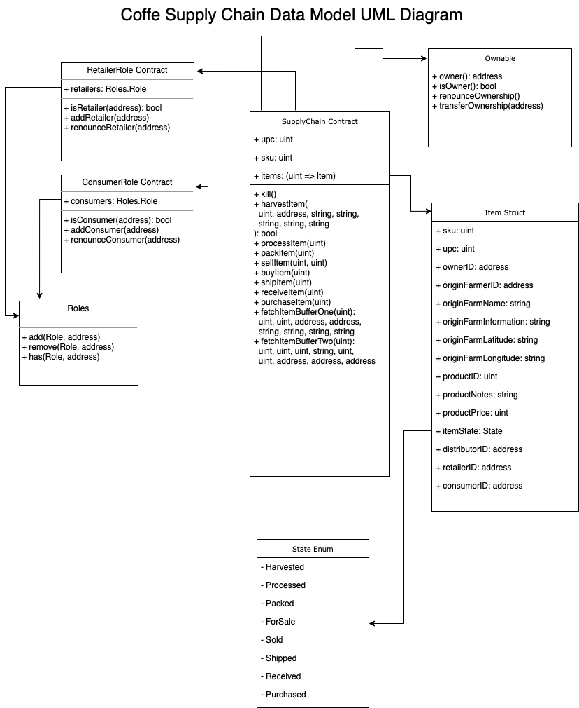

# Supply chain & data auditing

Changes from original boilerplate:
 - Truffle version: 5.5.21
 - Solidity version: ^0.8.0
 - `truffle-config.js` is used instead of `truffle.js`
 - Frontend application moved under `project-6/app` with webpack bundler and dev server
 - `jQuery` isn't be used at frontend application

## Write-ups
 - UML diagrams
 
 
 
 
 - `truffle-assertions` is added to test whether event is emitted or not with respect to transaction data
 - `webpack`, `webpack-cli`, `webpack-dev-server`, `copy-webpack-plugin` and `web3` is added for frontened application
 - During development ganache UI is used instead of ganache-cli trough 7545 port
 - `2_start.node.sh` is modified to run frontend application. Other than this, `cd project-6/app && npm run dev` can be run at the terminal. It'll be at `http://localhost:3000/`.
 - To install npm packages it should be be run `cd project-6 &&  npm install` then `cd app && npm install`. There'll be two different `node_modules` folders and both is added to `.gitignore` files

## Deployed smart contract on Rinkeby network
- Transaction ID: 0x51c0d18d3461c35a2af3b73c2720167c181a97a648edceae738ee95f1c95e4d1
- Contract address: 0x22eE7D79009b9eE8B370Bd6DA8C2051cC07b2F49


***Below part is taken from original repository.***

This repository containts an Ethereum DApp that demonstrates a Supply Chain flow between a Seller and Buyer. The user story is similar to any commonly used supply chain process. A Seller can add items to the inventory system stored in the blockchain. A Buyer can purchase such items from the inventory system. Additionally a Seller can mark an item as Shipped, and similarly a Buyer can mark an item as Received.

The DApp User Interface when running should look like...


## Getting Started

These instructions will get you a copy of the project up and running on your local machine for development and testing purposes. See deployment for notes on how to deploy the project on a live system.

### Prerequisites

Please make sure you've already installed ganache-cli, Truffle and enabled MetaMask extension in your browser.

```
Give examples (to be clarified)
```

### Installing
```

Change directory to ```project-6``` folder and install all requisite npm packages (as listed in ```package.json```):

```
cd project-6
npm install
```

Launch Ganache:

```
ganache-cli -m "spirit supply whale amount human item harsh scare congress discover talent hamster"
```

Your terminal should look something like this:


In a separate terminal window, Compile smart contracts:

```
truffle compile
```

Your terminal should look something like this:


This will create the smart contract artifacts in folder ```build\contracts```.

Migrate smart contracts to the locally running blockchain, ganache-cli:

```
truffle migrate
```

Your terminal should look something like this:


Test smart contracts:

```
truffle test
```

All 10 tests should pass.


In a separate terminal window, launch the DApp:

```
npm run dev
```

## Built With

* [Ethereum](https://www.ethereum.org/) - Ethereum is a decentralized platform that runs smart contracts
* [Truffle Framework](http://truffleframework.com/) - Truffle is the most popular development framework for Ethereum with a mission to make your life a whole lot easier.


## Acknowledgments

* Solidity
* Ganache
* Truffle
